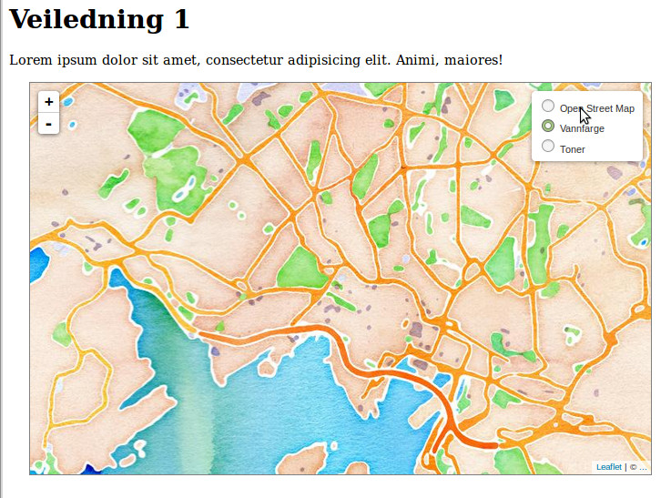

# Veiledning nr 1

Formålet med denne veiledning er å lage et simpelt kart på en webside og legge data om trafikkulykker fra Vegvesenet på. 

Nødvendig kode og filer er tilgjengelig på [github](https://github.com/GeoForum/geoforumtutorials/tree/master/www/veiledning01). Du kan bygge opp filstrukturen selv eller bruke filene i denne veiledning.

## Lag et kart med LeafletJS
Last ned [leafletjs](http://leafletjs.com/download.html) og legg filene et passende sted under "doc root" på ditt site - her er valgt å legge javascript filer unde `js/` og ccs filer under `jss/`. Lag en html fil - [se eksempel01.html](eksempel01.html) som linker til leaflet filene og andre ressurser.

```html
<link rel="stylesheet" type="text/css" href="css/leaflet.css">
<script type="text/javascript" src="js/leaflet.js"></script>
<script type="text/javascript" src="js/eks01.js"></script>
```
eller bruk alternativt hosted versjon av filene:
```html
<link rel="stylesheet" href="http://cdn.leafletjs.com/leaflet-0.7.3/leaflet.css" />
<script src="http://cdn.leafletjs.com/leaflet-0.7.3/leaflet.js"></script>
<script type="text/javascript" src="js/eks01.js"></script>
```

Html dokumentet skal inneholde et element som kartet renderes i, her `<div class="map" id="map"></div>`, deretter lages et kart med 3 lag:

```js
  var layers = [];
  var osm = L.tileLayer('http://{s}.tile.osm.org/{z}/{x}/{y}.png', {
      attribution: '&copy; <a href="http://osm.org/copyright">OpenStreetMap</a> contributors'
  });
  var watercoler = L.tileLayer('http://{s}.tile.stamen.com/watercolor/{z}/{x}/{y}.jpg', {
      attribution: '&copy; <a href="">...</a>'
  });
  var toner = L.tileLayer('http://{s}.tile.stamen.com/toner/{z}/{x}/{y}.jpg', {
      attribution: '&copy; <a href="">...</a>'
  });
  layers.push(osm, watercoler, toner);
  var map = app.map = L.map('map', {
      center: [59.91235, 10.7357]
    , zoom: 11
    , layers: layers
  })
```
Hvis du tester siden i din nettleser nå, vil du se, at det siste laget legger seg øverst og de andre lag ikke kan sees. For å kunne skiftet mellom lagene, tilføyes et verktøy til å skifte lag:

```js
  var baseMaps = {
      "Open Street Map": osm
    , "Vannfarge": watercoler
    , "Toner": toner
  };
  var overlays = {};
  L.control.layers(baseMaps, overlays).addTo(map);
```

Voila, du har nå et simpelt kart på siden din som ser slik ut:



## Kart-projeksjoner og konvertering

Jorden er en kule og både papir og skjerme er flat - og det finnes derfor mange måter å projisere data fra kule til flate på. Både leaflet og lignende (fx OpenLayers, Google Maps mv) bruker som utgangspunkt en Mercator-projeksjon med koden "EPSG:3857", mens det er vanlig i Norge å bruke UTM projeksjoner som er tilpasset lokalt bruk. Disse har fx koder som "EPSG:25832", "EPSG:32632", "EPSG:25833" og "EPSG:32633".

Åpne data fra fx Statens Kartverk mv er ofte tilgjengelig i disse projeksjoner, og kan derfor være nødvendig å konvertere mellom forskjellige projeksjoner. Det kan gjøres på mange måter, vil vi gjøre det med en javascript-komponent kallet [Proj4js](http://proj4js.org/).

Vi skal ikke gå i dybden med projeksjoner i denne veiledning, men her er en kort oversikt over noen fordeler og ulemper:

#### Mercator
* Fordeler:
  * Globalt koordinatsystem.
  * Viser lett hele kloden på et kart.
* Ulemper:
  * Områder langt fra ekvator vises svært forvrengt.
  * Koordinatsystemet er ikke kvadratisk.
  * Enheten for koordinater er grader, som kan være vanskelig å lage beregninger på.

#### UTM
* Fordeler:
  * Enheten for koordinater er meter.
  * Koordinatsystemet er kvadratisk.
* Ulemper:
  * Koordinatsystemet dekker et begrenset område, en såkalt UTM-zone.

Vil du vite mer om forskjellige koordinatsystem, kan du bla lese mer her ... [savner linker](http://foo.bar/):
* http://www.sharpgis.net/post/2007/05/05/Spatial-references2c-coordinate-systems2c-projections2c-datums2c-ellipsoids-e28093-confusing
* https://en.wikipedia.org/wiki/Spatial_reference_system
* http://communityhub.esriuk.com/journal/2012/3/26/coordinate-systems-and-projections-for-beginners.html
